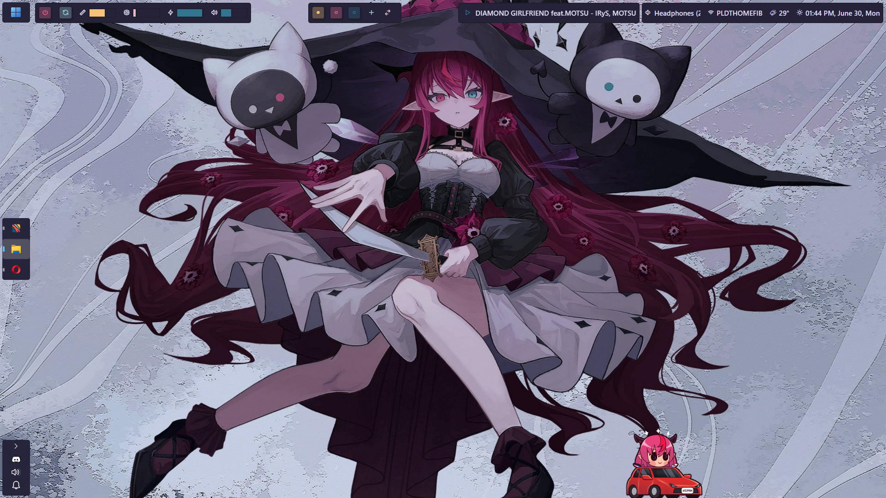

# 🟦 Neobrutal [Zebar](https://github.com/glzr-io/zebar) - Personal Fork

A personal modified version of the Neobrutal Zebar configuration for Zebar, built in Svelte with Tailwind. Since the original creator did an amazing job, I wanted to continue developing it with new Zebar features and ideas!

> [!NOTE]
> 
> This is a personal fork of [adriankarlen/neobrutal-zebar](https://github.com/adriankarlen/neobrutal-zebar), which has been archived. This version includes my own modifications and improvements to the original design. I plan to continue developing this project with new features, improvements, and support for the latest Zebar capabilities.

## ✨ Features

- Process icons for current workspace, with current focus indicator.
- System information meters, with shutdown and restart buttons.
- Media display for browser and music player.
- Animations like process focus, workspace switching, and marquee scrolling.
- Dynamic coloring.
- Configuration using CSS-variables.

> [!IMPORTANT]
>
> This configuration is in early development! Contributions are very welcome, especially:
> - **Process icon mappings** - Help expand the icon map for better app recognition
> - **Media display improvements** - Better browser and music player compatibility  
> - **New Zebar features** - Integration of latest Zebar capabilities
> - **Theme contributions** - New color schemes and visual styles
> - **Bug reports and feature requests** - Help make this better for everyone!
> 
> The original creator did incredible work, and I want to keep that spirit alive. If you have any issues, ideas, or want to contribute, please open an issue or PR on the GitHub repository!

## 🖼️ Showcase

### My Personal Setup



### Original Examples


## 🚀 Getting started

> [!NOTE]
> If you are using window scaling in windows, you might need to edit
> `bar.zebar.json` to get a correct height (default is `60px`).

### Installation

#### Prerequisites

- **[Zebar](https://github.com/glzr-io/zebar)** - The desktop widget framework this configuration is built for
- **[GlazeWM](https://github.com/glzr-io/glazewm)** - The tiling window manager (required for workspace and window management features)
- **Package manager/runtime** of your choice (`npm` (recommended), `pnpm`, `yarn`, etc). This fork uses
  `npm` for package management.

#### Instructions

1. Download or clone this repo into your zebar configuration directory
2. Edit your Zebar `settings.json` to point to the neobrutal directory + `/build/index.html`. Example: `neobrutal-zebar/build/index.html`
3. Navigate to the root dir of neobrutal-zebar.
4. Run a install command for your selected package manager.
   ```bash
   npm install
   ```
5. Make any edits you want (see [Themes](#Themes) and [Recipies](#Recipies) )
6. Build the project
   ```bash
   npm run build
   ```
7. Launch Zebar

In `config.css` there exists a lot of configuration available to tweak.

## ⚙️ Additional Configuration

> [!IMPORTANT]
> **Power Controls Setup**: The shutdown and restart buttons require additional configuration in your GlazeWM settings to work properly.

Add the following to your GlazeWM `config.yaml` file:

```yaml
general:
  # ...existing config...
  shell_exec:
    # Allow shell execution for power controls
    enabled: true
```

Or alternatively, you can add custom keybindings to your GlazeWM config:

```yaml
keybindings:
  # ...existing keybindings...
  
  # Power controls
  - command: "shell-exec shutdown /s /t 0"
    bindings: ["Alt+F4"]
  - command: "shell-exec shutdown /r /t 0"  
    bindings: ["Alt+Shift+F4"]
```

Without this configuration, the power buttons in the bar will not function.

## 🎨 Themes

Neobrutal currently ships with 4 different themes, Rosé Pine, Catppuccin, Nord
and Material. Below follows some examples.

### 🌷Rosé Pine (default)

Utilizes [Rosé Pine Palette](https://rosepinetheme.com/palette), a soothing and elegant color scheme.

<details>
<summary>Example config</summary>

##### config.css

```css
/* colors */
  --text: var(--rp-text);
  --bg: var(--rp-overlay);
  --border: var(--rp-highlight-low);
  --shadow: var(--rp-highlight-low);
  --power: var(--rp-love);
  --restart: var(--rp-foam);
  --memory: var(--rp-iris);
  --memory-medium: var(--rp-gold);
  --memory-high: var(--rp-love);
  --cpu: var(--rp-rose);
  --cpu-high-usage: var(--rp-love);
  --battery-good: var(--rp-pine);
  --battery-mid: var(--rp-gold);
  --battery-low: var(--rp-love);
  --volume-muted: var(--rp-foam);
  --volume-low: var(--rp-iris);
  --volume-medium: var(--rp-pine);
  --volume-high: var(--rp-rose);
  --focused-process: var(--rp-text);
  --process: var(--rp-muted);
  --displayed: var(--rp-text);
  --ws-1: var(--rp-gold);
  --ws-2: var(--rp-love);
  --ws-3: var(--rp-pine);
  --ws-4: var(--rp-foam);
  --ws-5: var(--rp-iris);
  --tiling-direction: var(--rp-rose);
  --add-workspace: var(--rp-foam);
  --not-playing: var(--rp-love);
  --now-playing: var(--rp-pine);
```

</details>

### 😸 Catppuccin

Utilizes [Catppuccin Palette](https://github.com/catppuccin/palette/blob/main/docs/css.md), configure css variables accoriding to your liking.

### ❄️ Nord

Utilizes [Nord Theme](https://www.nordtheme.com/) color palette, providing a cool arctic aesthetic.

### 🎨 Material Design

Based on [Material Design Color System](https://m2.material.io/design/color/), offering vibrant and accessible colors.

## 🍳 Recipies

<details>
<summary>Soft Brutal</summary>

```css
--radius: 9999px;
```


</details>
<details>
<summary>Round bars without shadow</summary>

```css
--border-size: 1px;
--radius: 9999px;
--shadow-size-bar: 0px;
--shadow-size-button: 0px;
```


</details>

## 📜 License

This project is licensed under the MIT License - see the
[LICENSE](LICENSE) file
